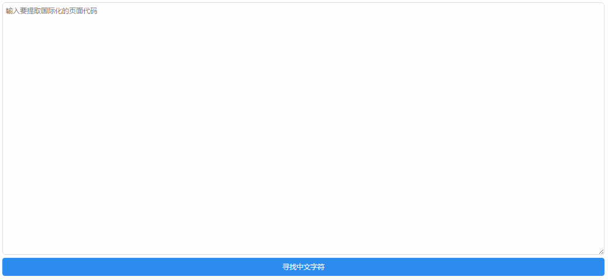
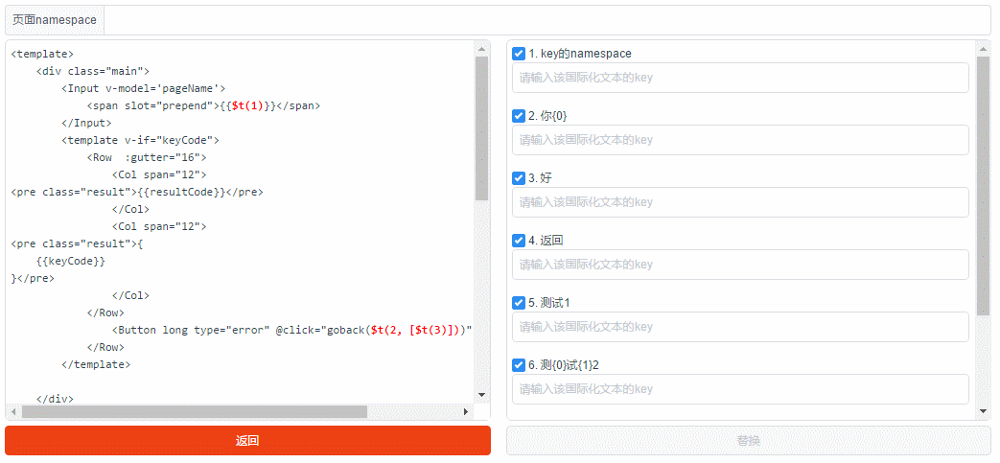
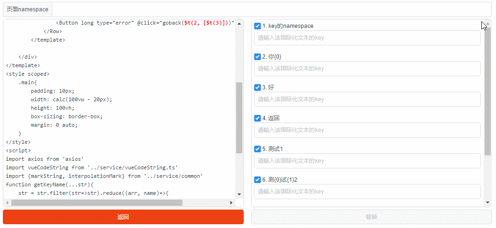
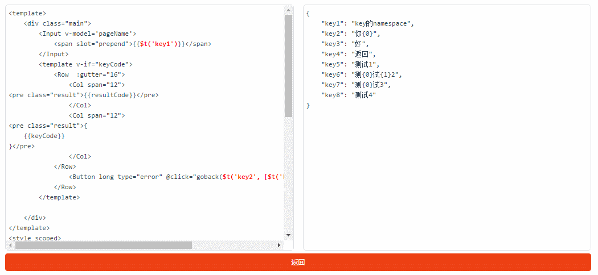

# vue-i18n-tools

一个vue的模板提取中文文本的工具，用于做国际化提取文本——[vue-i18n-tools。](https://laden666666.github.io/vue-i18n-tools/ "") 

## 使用教程

### 输入vue文件源码

先将vue文件（sfc控件）的源代码粘贴到文本框中，点击“寻找中文字符串”，工具会将vue文件中所有中文字符串全部找出。

### 选择国际化的文本

点击右侧的复选框，选择要国际化的文本。

### 设置vue-i18n的key

为选择好的国际化文本设置vue-i18n的key。

### 生成国际化文件和国际化后的vue源码

点击替换，即可生成国际化文件，如图右侧部分的内容。同时还会生成国际化后的源码，如图左侧部分的内容。

## todo
*   自动命名key
*   自动翻译
*   key库管理
*   自定义文本检查正则
*   自定义国际化函数
*   js类型文件国际化
*   增加一个cli工具

